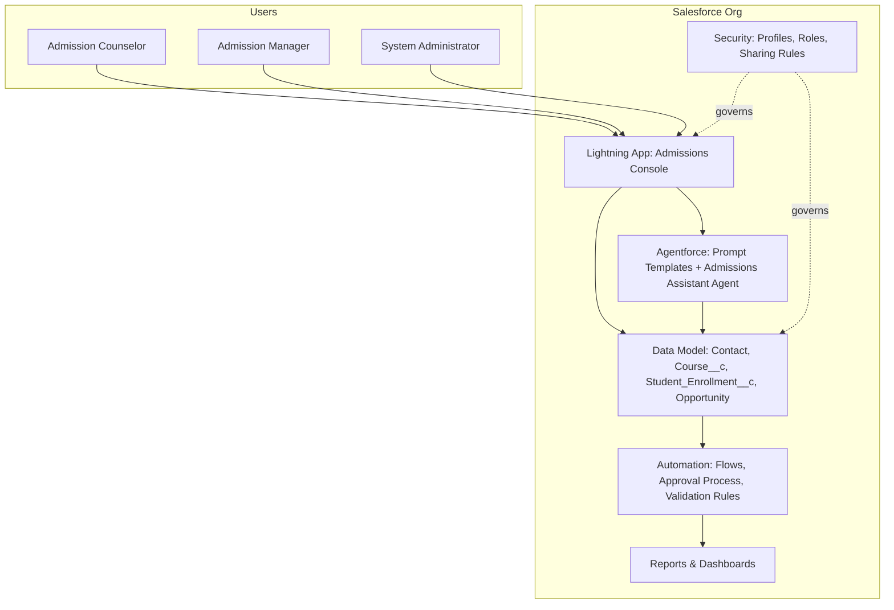
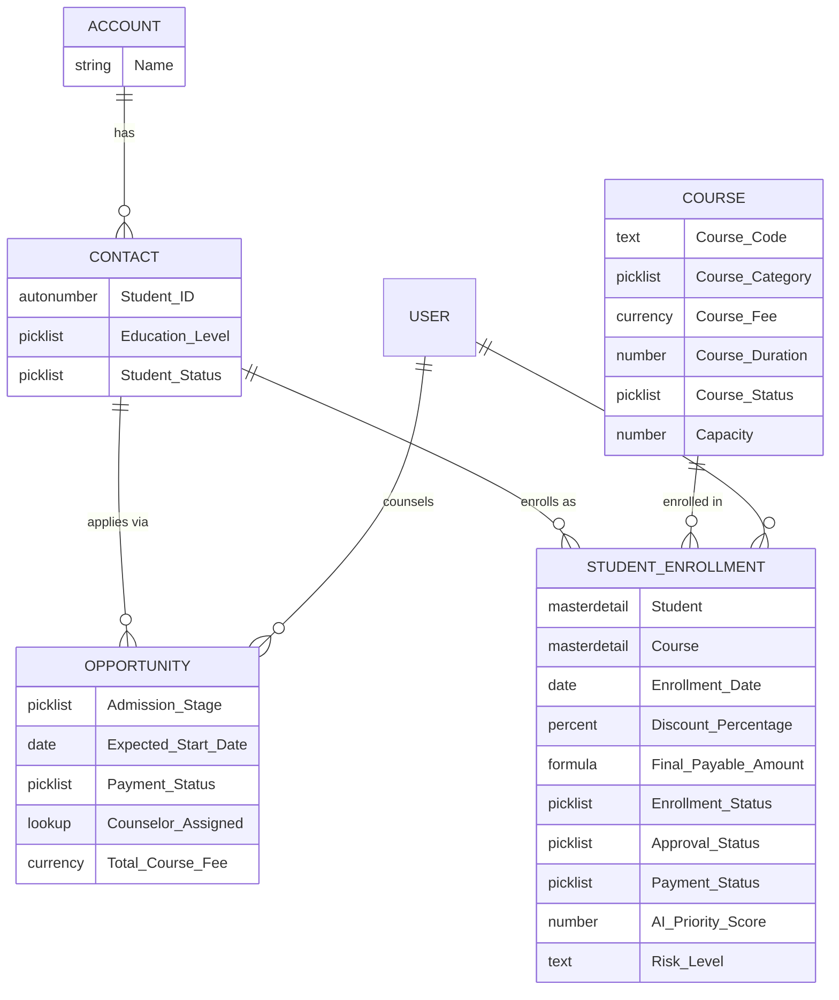
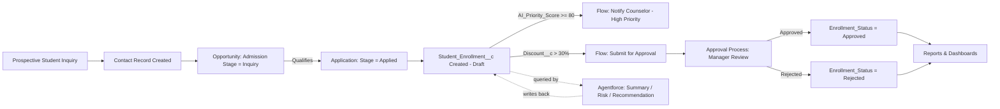
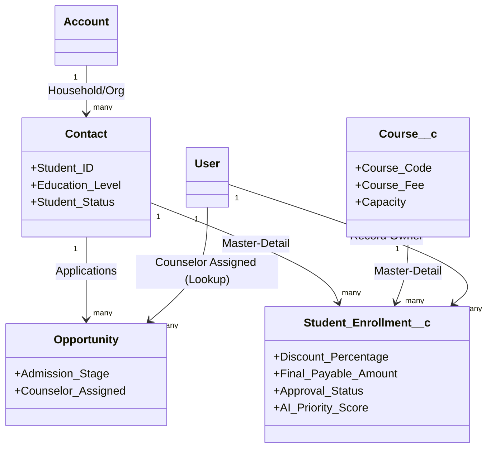
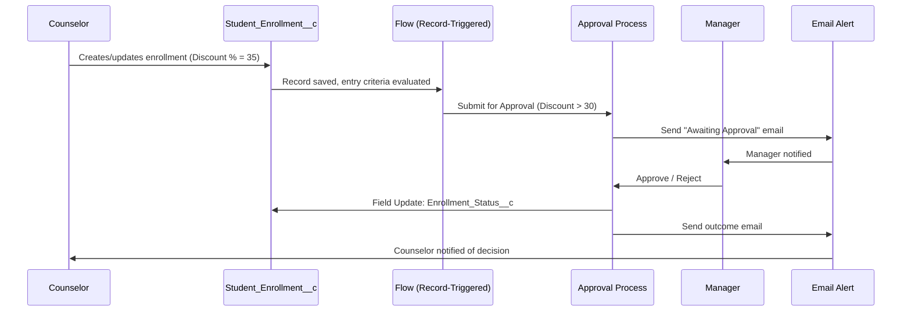

# 2. System Architecture

## 2.1 High-Level Architecture

**Explanation:** Users interact only through the Lightning App. All business logic lives in declarative
automation (Flows, Approval Process, Validation Rules) sitting on top of the data model. The security
layer governs what every persona can see and do. Agentforce reads from the data model (via the Data
Library) to generate summaries and recommendations, and can write back priority/risk fields through
Flow-invoked actions. Reports & Dashboards are generated from the same data model for real-time visibility.

## 2.2 Entity Relationship Diagram (ERD)

**Explanation:** `Student_Enrollment__c` is the transactional core, master-detail to both `Contact`
(Student) and `Course__c`. This enforces that an enrollment cannot exist without its parent student and
course, and lets rollups/reporting roll up cleanly. `Opportunity` tracks the pre-enrollment sales/admission
pipeline (Inquiry → Applied → Enrolled) and is where the counselor and expected revenue are tracked before
conversion.

## 2.3 Data Flow Diagram

**Explanation:** Data flows left to right from first inquiry through to a final enrollment decision, with
two automation branches firing off the same `Student_Enrollment__c` record: a priority-notification branch
(AI-scored) and a discount-approval branch (business-rule-driven). Agentforce sits alongside the record,
reading it for context and optionally writing recommendations back onto priority/risk fields.

## 2.4 Object Relationship Diagram

## 2.5 Process Flow Diagram — Discount Approval

