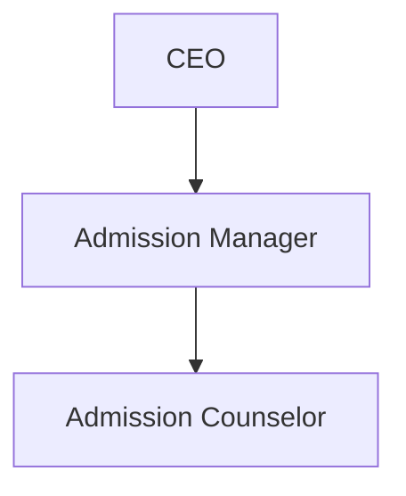

# 5. Security Model

## 5.1 Org-Wide Defaults (OWD)
| Object | Internal OWD | External OWD |
|---|---|---|
| Account | Public Read/Write | Private |
| Contact | Controlled by Parent | Private |
| Opportunity | Private | Private |
| Course__c | Public Read Only | Private |
| Student_Enrollment__c | Private | Private |

**Rationale:** Enrollments and Opportunities are private by default so counselors see only their own
students unless explicitly shared — Role Hierarchy and Sharing Rules grant broader visibility to managers.

## 5.2 Role Hierarchy

- **Admission Manager** — sees all records owned by counselors below them in the hierarchy (role hierarchy
  grants this automatically for Private OWD objects).
- **Admission Counselor** — sees only their own owned records (Opportunities, Enrollments).

## 5.3 Profiles
| Profile | Cloned From | Object Permissions | Notes |
|---|---|---|---|
| Admission Counselor Profile | Standard User | Read/Create/Edit on Contact, Student_Enrollment__c, Course__c, Task; Read-Only Reports/Dashboards | Session timeout 2 hrs; password expiry 90 days, min length 8 |
| Admission Manager Profile | Standard User | Read/Create/Edit/Delete on all admissions objects; Approve permission | Broader visibility via role hierarchy |
| System Administrator | Standard (unmodified) | Full access | Manages Agentforce, Flows, security |

### Field-Level Security highlights
| Field | Counselor | Manager | Admin |
|---|---|---|---|
| AI Priority Score | Read Only | Read Only | Read/Write |
| Risk Level | Read Only | Read Only | Read/Write |
| Approval Status | Read Only | Read/Write | Read/Write |
| Discount Percentage | Read/Write | Read/Write | Read/Write |

## 5.4 Permission Sets
| Permission Set | Purpose | Assigned To |
|---|---|---|
| Agentforce Access | Grants Agentforce/agent usage rights without editing base profile | Counselor, Manager |
| Approval Override | Allows Manager to reassign/skip approval steps in exceptional cases | Admission Manager |

## 5.5 Sharing Rules
| Rule | Object | Criteria | Shared With | Access |
|---|---|---|---|---|
| High-Priority Enrollment Visibility | Student_Enrollment__c | AI_Priority_Score__c ≥ 80 | Admission Manager role (and subordinates) | Read/Write |
| Cross-Counselor Course Visibility | Course__c | All records | All Internal Users role and subordinates | Read Only (OWD already Public Read Only, rule optional) |

## 5.6 Login Restrictions & Session Settings
- Login IP Ranges: restrict Admission Counselor / Manager profiles to office network CIDR range (configurable per deployment).
- Login Hours: 7 AM – 9 PM local time for Counselor profile (adjust per institute operating hours).
- Session Settings: Session timeout 2 hours (Counselor), "Lock sessions to the IP address from which they originated" enabled, "Force logout on session timeout" enabled.
- Multi-Factor Authentication: enforced org-wide via Salesforce MFA (mandatory since Salesforce's MFA requirement).
