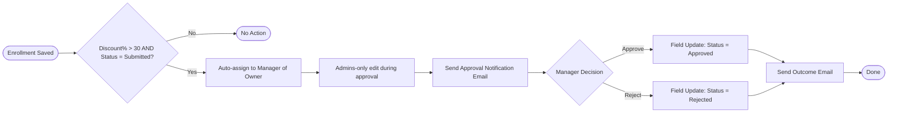
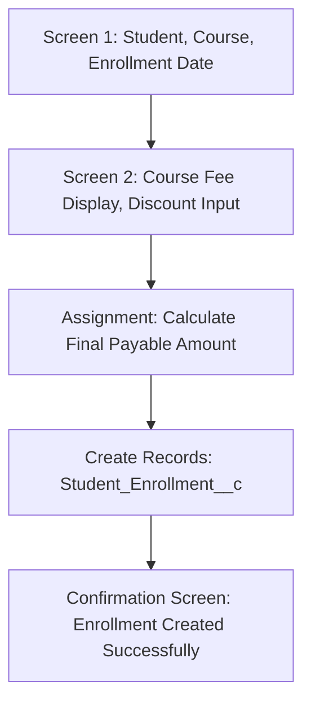

# 6. Automation

## 6.1 Validation Rules (recap — see `03-data-model.md` for full formulas)
| Object | Rule | Formula | Message |
|---|---|---|---|
| Course__c | Course Fee Validation | `Course_Fee__c <= 0` | Course Fee must be greater than zero. |
| Opportunity | Start Date Validation | `Expected_Start_Date__c < TODAY()` | Expected Start Date cannot be in the past. |
| Student_Enrollment__c | Discount Percent Validation | `Discount_Percentage__c > 50` | Discount cannot be greater than 50%. |

## 6.2 Email Templates (Classic, Text)
| Template | Trigger Context | Key Merge Fields |
|---|---|---|
| High Priority Student Application Notification | AI Priority Score ≥ 80 | Student Name, Course, AI Priority Score, Enrollment Date |
| High Discount Student Enrollment Approval Notification | Discount > 30% submitted | Student Name, Course, Course Fee, Discount %, Final Payable Amount |
| Student Enrollment Approval Status Notification | Approval decided | Student Name, Course, Approval Status, Final Payable Amount |

## 6.3 Email Alerts
| Alert | Object | Template | Recipient |
|---|---|---|---|
| High Priority Student Application Email Alert | Student_Enrollment__c | High Priority Student Application Notification | Enrollment Owner |
| High Discount Enrollment Approval Email Alert | Student_Enrollment__c | High Discount Student Enrollment Approval Notification | Manager (of owner) |
| Student Enrollment Approval Status Email Alert | Student_Enrollment__c | Student Enrollment Approval Status Notification | Enrollment Owner |

## 6.4 Approval Process — "High-Discount Student Enrollment Approval"

- **Entry Criteria:** `Discount_Percentage__c > 30` AND `Enrollment_Status__c = 'Submitted for Approval'`
- **Approver:** Automatically assigned → Manager of Record Owner
- **Record Editability:** Administrators only, during approval
- **Initial Submitters:** Record Owner
- **Final Approval Action:** Field Update → `Enrollment_Status__c = 'Approved'`
- **Final Rejection Action:** Field Update → `Enrollment_Status__c = 'Rejected'`
- **Approval Step:** Step 1 — all records enter this step

## 6.5 Record-Triggered Flow — High Priority Notification
- **Object:** Student_Enrollment__c · **Trigger:** Create or Update
- **Entry Condition:** `AI_Priority_Score__c >= 80`
- **Optimize for:** Actions and Related Records
- **Action:** Send Email Alert → High Priority Student Application Email Alert
- **Decision Logic:** none needed beyond entry condition (single branch)

## 6.6 Record-Triggered Flow — High Discount Submission
- **Object:** Student_Enrollment__c · **Trigger:** Create or Update
- **Entry Condition:** `Discount__c > 30`
- **Action:** Submit for Approval → High-Discount Student Enrollment Approval

## 6.7 Scheduled Flow — Pending Enrollment Follow-Up
- **Frequency:** Daily, 9:00 AM
- **Object:** Student_Enrollment__c
- **Filter:** `Approval_Status__c = 'Pending'` AND `LastModifiedDate < TODAY() - 2`
- **Collection Variable:** collects all matching records into a loop
- **Loop Element:** iterates the collection, sends the reminder email per record
- **Action inside loop:** Send Email Alert → Student Enrollment Approval Status Email Alert

## 6.8 Screen Flow — Student Enrollment Creation Wizard

- Uses a **Formula resource** to compute `{Course Fee} * (1 - {Discount}/100)` shown live on Screen 2.
- **Get Records** element fetches the selected Course's fee before Screen 2 renders.

## 6.9 Formula Fields Summary
| Field | Object | Formula |
|---|---|---|
| Final Payable Amount | Student_Enrollment__c | `Course__r.Course_Fee__c * (1 - (Discount__c / 100))` |

## 6.10 Workflow / Decision Logic Notes
All logic is implemented in Flow Decision elements rather than legacy Workflow Rules (Salesforce
recommends Flow for all new automation). Two Decision elements are used across the two record-triggered
flows: one evaluating priority score threshold, one evaluating discount threshold — kept in **separate**
flows per Salesforce best practice of one flow per object per trigger context where logic is unrelated,
to keep debugging and maintenance simple.
