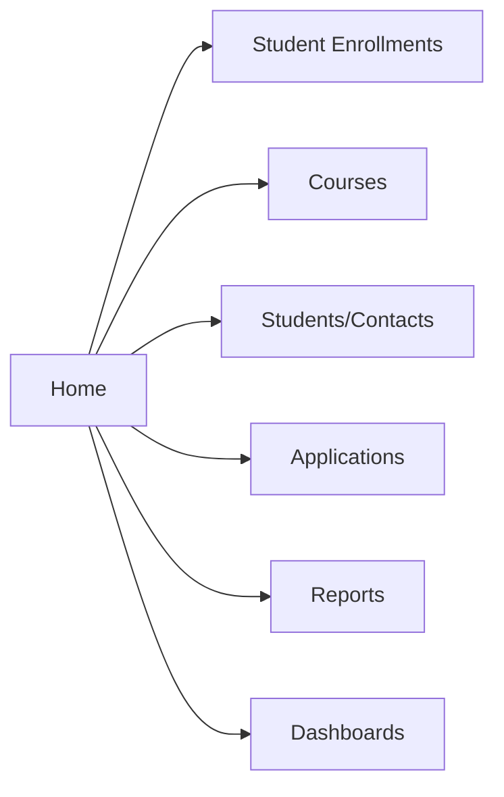

# 9. UI Design

## 9.1 Lightning App — "AI-Enabled Student Admissions & Support Management System"
- App Manager → New Lightning App → upload app icon/image
- Navigation items (in order): Home, Student Enrollments, Courses, Contacts, Opportunities, Reports, Dashboards
- Utility Bar: Notes, Recent Items, History
- Assigned Profiles: System Administrator, Admission Counselor Profile, Admission Manager Profile

## 9.2 Navigation Menu

## 9.3 Home Page (Lightning App Builder — Home Page Type)
| Region | Component |
|---|---|
| Top | Global Search + Assistant / Today's Tasks |
| Left (2/3) | Pending Approvals list view, High Priority Enrollments list view |
| Right (1/3) | Admissions Dashboard snapshot, Agentforce quick-launch tile |

## 9.4 Student (Contact) Page
- Highlights Panel: Name, Student ID, Education Level, Student Status
- Tabs: Details (Dynamic Form), Related (Enrollments, Opportunities, Activities), Agentforce

## 9.5 Course Page
- Highlights Panel: Course Name, Course Code, Course Fee, Capacity, Status
- Related List: Student Enrollments (filtered to this course)
- Component: Capacity gauge (Enrolled vs Capacity)

## 9.6 Enrollment Page (`Student_Enrollment__c`)
- Highlights Panel: Student Enrollment ID, Enrollment Status, Approval Status
- Path component across Enrollment Status (Draft → Pending Approval → Approved)
- Dynamic Form sections: Identification, Fee & Discount, Status, AI Insights (see `04-configuration.md`)
- Right sidebar: **Agentforce Panel** (embedded conversational component)
- Related Lists: Approval History, Email history

## 9.7 Dashboard Page
- Full-width Lightning page hosting the 5 dashboards as tabs/sub-tabs for quick switching by role.

## 9.8 Agentforce Panel
- Docked utility panel or record-page side component
- Quick-action buttons: "Summarize", "Analyze Risk", "Recommend Discount Decision"
- Chat input for free-form questions, scoped to the current record via the Data Library

## 9.9 Modern UI Recommendations
- Use Lightning Design System (SLDS) icons consistently per object (graduation cap for Course, person for
  Contact/Student)
- Use color-coded picklist chips for Enrollment Status / Approval Status (Draft = grey, Pending = amber,
  Approved = green, Rejected = red)
- Keep Dynamic Forms sections to ≤5 fields each for scanability
- Use Path component on Enrollment Status to visually communicate lifecycle progress
